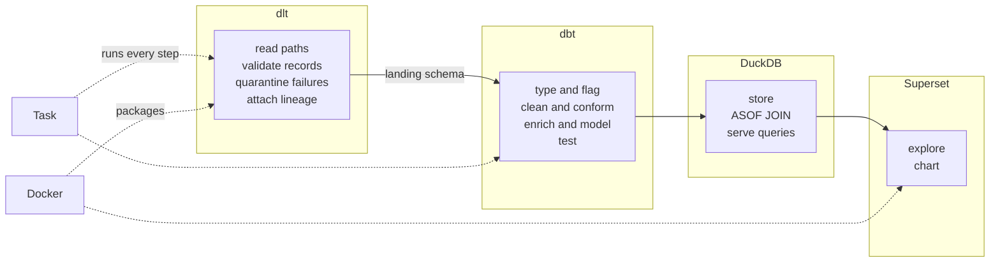
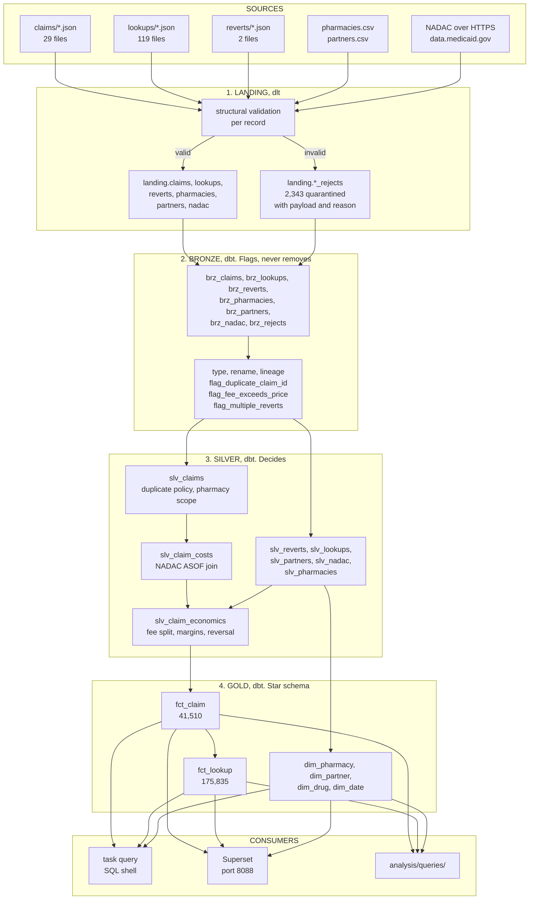
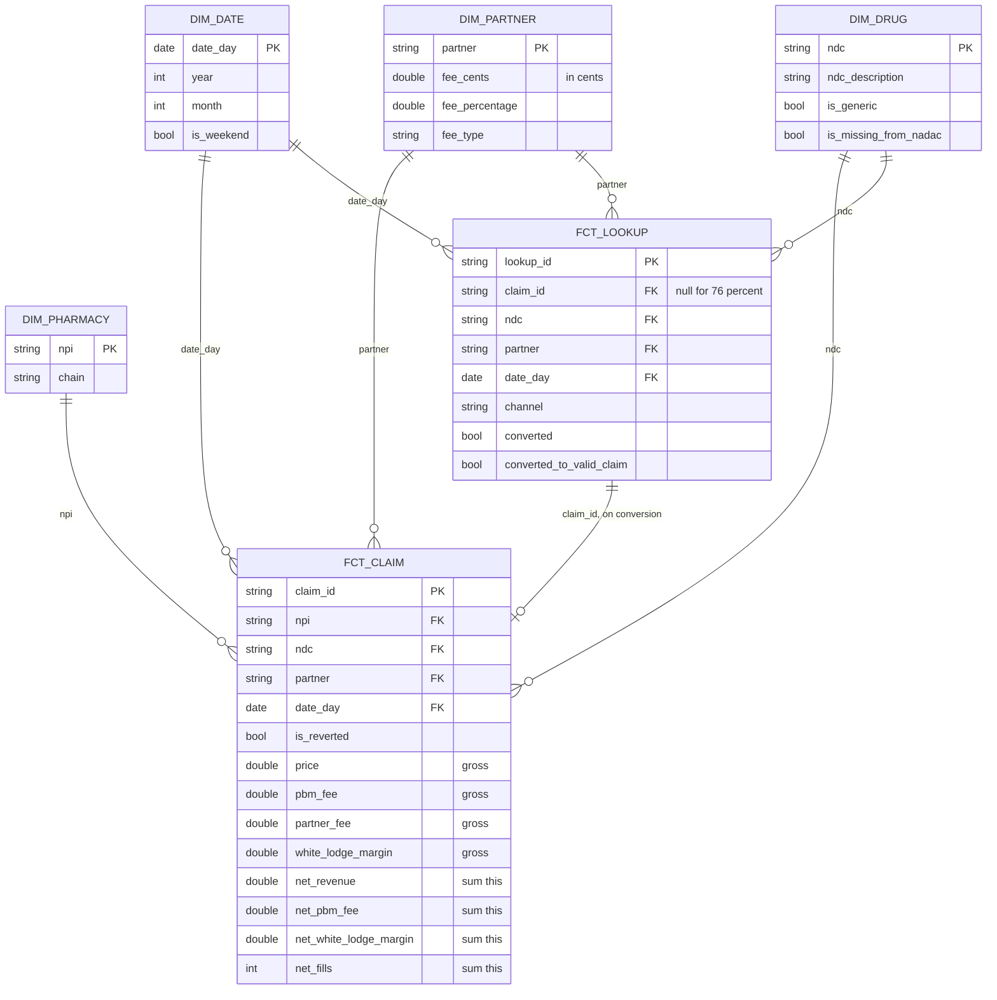
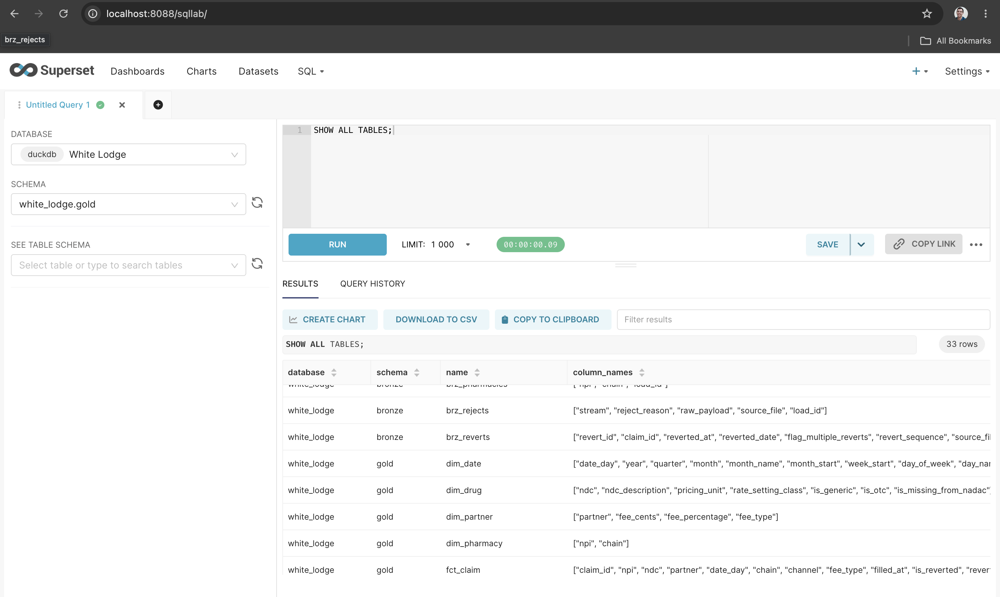
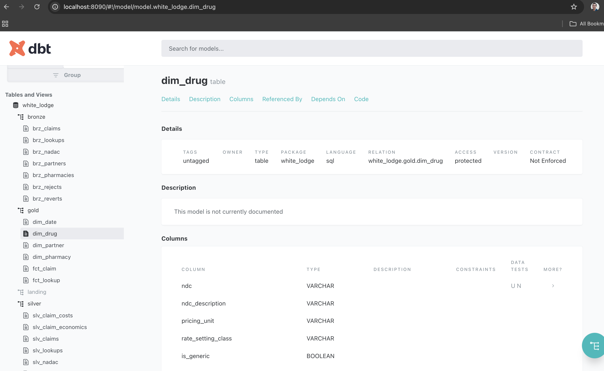
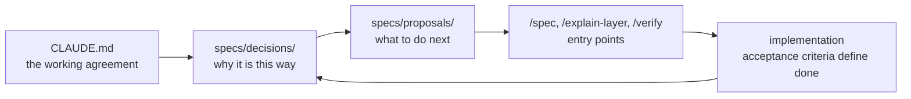

# White Lodge Savings, Pharmacy Events Data Warehouse

A queryable data warehouse built over raw pharmacy events (claims, reversals and price
lookups), enriched with partner commercial terms and public NADAC drug cost benchmarks.

Built for the [Analytics / Data Engineer take-home](CHALLENGE.md). The deliverable is a
warehouse that runs, is queried and is modified on a laptop. It is not a one-off script and
not a production platform.

| Property | Value |
|---|---|
| Cold build time | 60 seconds from an empty warehouse |
| Rows modelled | 41,510 claims, 175,835 lookups, 1,028,250 NADAC snapshot rows |
| Tests | 61 dbt nodes, 21 pytest, all passing |
| Warehouse artifact | one file: `data/warehouse/white_lodge.duckdb` |
| Source files read | 150 JSON files, 2 CSV files, 1 remote CSV |

---

## Contents

1. [What the project does](#1-what-the-project-does)
2. [Tools used, and what each one does](#2-tools-used-and-what-each-one-does)
3. [How to run it](#3-how-to-run-it)
4. [Where the data comes from](#4-where-the-data-comes-from)
5. [Architecture](#5-architecture)
6. [Data flow](#6-data-flow)
7. [The star schema](#7-the-star-schema)
8. [Repository structure](#8-repository-structure)
9. [Design decisions](#9-design-decisions)
10. [Querying, charting and the data catalog](#10-querying-charting-and-the-data-catalog)
11. [Tests](#11-tests)
12. [Spec-driven development for AI](#12-spec-driven-development-for-ai)
13. [Limits and next steps](#13-limits-and-next-steps)

---

## 1. What the project does

**The business context.** White Lodge Savings is a Pharmacy Benefit Manager (PBM). It sits
between patients, pharmacies and partners. A patient looks up a drug price through a
partner, fills the prescription at a pharmacy, and White Lodge collects a fee on the claim
which it shares with the partner that drove the business. When a fill does not complete, the
pharmacy submits a reversal, which invalidates the claim.

**The starting point.** Events arrive as directories of JSON files. Reference data sits in
CSV files. Drug costs come from a public government dataset published as weekly snapshots.
There is no data model, so business questions cannot be answered with a query.

**What this repository builds.** A four zone warehouse that turns those files into a
dimensional model. The output supports questions such as:

- Revenue, fees and retained margin per partner and per pharmacy chain
- Conversion and drop-off across the lookup, claim and reversal funnel
- Margin per drug, measured against the NADAC acquisition cost benchmark
- Volume and value of every record excluded during processing, and the reason

Every figure is reversal aware, every claim is cost attributed against a dated NADAC
snapshot, and every excluded record remains queryable.

---

## 2. Tools used, and what each one does

### Ingestion: dlt (dlthub)

[dlt](https://dlthub.com) is a Python library for extract and load. It is used for **every
source read and every write into the warehouse**.

| Responsibility | How dlt is used |
|---|---|
| Reading local event streams | `@dlt.resource` generators glob `claims/*.json`, `lookups/*.json`, `reverts/*.json` and yield records |
| Reading reference data | Separate resources read the pharmacy and partner CSV files |
| Reading the remote NADAC dataset | A resource streams an 85 MB CSV over HTTPS from `data.medicaid.gov` and caches it to disk, so re-runs are offline |
| Quarantine routing | `dlt.mark.with_table_name` sends failed records to `<stream>_rejects` instead of the main table |
| Schema inference and typing | dlt infers column types and creates the DuckDB tables |
| Lineage | Each row carries `_source_file` and `_dlt_load_id`, so any row traces back to its file and load |
| Load packaging | Atomic loads, with `write_disposition="replace"` for full refresh |

**Why dlt rather than reading files directly.** Two reasons. The NADAC pull is a remote,
paginated, cached HTTP source, which is the shape dlt is designed for. And quarantine needs
a place to write rejected payloads with load identifiers attached, which dlt provides
without extra code.

Code: [`src/white_lodge/ingest/`](src/white_lodge/ingest/)

### Transformation: dbt (dbt-core with dbt-duckdb)

[dbt](https://docs.getdbt.com) is a SQL transformation framework. It owns **everything after
the raw landing zone**: 21 models across three layers.

| Responsibility | How dbt is used |
|---|---|
| Model layering | Folder per layer (`bronze/`, `silver/`, `gold/`), with materialisation set per layer in `dbt_project.yml` |
| Dependency graph | `ref()` builds the DAG, so `task transform` runs models in the correct order |
| Reusable logic | The fee split is a macro, `partner_fee_share`, called from one model |
| Configurable policy | Two `vars` expose modelling choices as flags: `duplicate_claim_policy` and `nadac_cost_basis` |
| Data tests | 61 nodes: uniqueness, not-null, referential integrity, accepted values, plus 8 custom SQL assertions |
| Schema naming | A `generate_schema_name` override produces `bronze` / `silver` / `gold` rather than dbt's default prefixed names |
| Documentation | `task docs` generates a browsable lineage graph |

**Why dbt rather than SQL scripts.** The dependency graph, the test framework and the
`vars` mechanism are all used. Modelling decisions are changed by editing one SQL file or
passing one flag, which matters because the requirements change during the live session.

Code: [`transform/`](transform/)

### Warehouse: DuckDB

[DuckDB](https://duckdb.org) is an embedded analytical database. The entire warehouse is a
single file, `data/warehouse/white_lodge.duckdb`.

| Responsibility | How DuckDB is used |
|---|---|
| Storage and query engine | All four schemas live in one file, portable and copyable |
| `ASOF JOIN` | Used to price each claim at the NADAC snapshot in force on its fill date. See [section 9](#9-design-decisions) |
| Window functions | Duplicate detection, revert sequencing, snapshot selection |
| `generate_series` | Builds `dim_date` from the observed event date range |
| Read-only connections | The query shell and Superset both connect with `access_mode=read_only` |

**Why DuckDB rather than Postgres.** No concurrency requirement exists here, and the
`ASOF JOIN` performs cost attribution in one pass. A single file also means the whole
warehouse is handed over by copying it.

**Constraint to be aware of.** DuckDB permits many readers or one writer, never both. See
[locking](#a-note-on-locking).

### Command runner: Task (go-task)

[Task](https://taskfile.dev) is a YAML-based command runner. `Taskfile.yaml` is the single
entrypoint: 28 tasks covering setup, ingestion, transformation, containers, querying and
teardown.

| Responsibility | How Task is used |
|---|---|
| Pipeline steps | `task ingest` and `task transform` run the two stages independently |
| Container control | `task up`, `task down`, `task ps` wrap docker compose |
| Concurrency guard | `task ingest` and `task transform` acquire a lock, since DuckDB accepts one writer |
| Idempotence | `status:` guards skip unpacking data or installing dbt packages when already done |
| Environment | `dotenv: [".env"]` loads source paths, so no path is hardcoded |

**Why Task rather than Make.** Named parameters, `status:` preconditions and `deps:` are
used directly. The YAML format also documents itself in `task --list`.

### Containers: Docker and Docker Compose

Two images are defined.

| Image | Base | Contains | Purpose |
|---|---|---|---|
| `white-lodge-pipeline` | `python:3.12-slim` | uv, the package, dbt project | Runs ingestion and transformation in a reproducible environment |
| `white-lodge-superset` | `apache/superset:4.1.4` | duckdb 1.5.5, duckdb-engine | Serves the charting interface |

Compose wires them to a shared `./data` volume. The pipeline service sits behind a compose
**profile**, so `docker compose up` starts only Superset and never triggers a data load.

Code: [`docker/`](docker/)

### Visualisation: Apache Superset

[Superset](https://superset.apache.org) is a business intelligence application. It is used
for the live analytics session: writing SQL against the warehouse and turning results into
charts without writing plotting code.

| Responsibility | How Superset is used |
|---|---|
| SQL exploration | SQL Lab runs ad-hoc queries against all four schemas |
| Charts and dashboards | Query results are saved as charts and assembled into dashboards |
| Connection | Registered automatically at container boot as `White Lodge`, read-only |
| Driver | `duckdb-engine`, a SQLAlchemy dialect over the Python `duckdb` package |

**Why Superset rather than Metabase.** Metabase's community DuckDB driver is a JDBC plugin
whose last release was in 2024, built against DuckDB 0.10. It cannot open a DuckDB 1.5
storage file. `duckdb-engine` wraps the Python `duckdb` package, so pinning `duckdb==1.5.5`
in the Superset image matches the version the pipeline writes with, and compatibility is
guaranteed by construction.

**Scope note.** The brief lists a BI server as out of scope. Superset is present as tooling
for the analyst, not as a deliverable, which is why it sits behind an opt-in compose profile.

Code: [`docker/superset/`](docker/superset/)

### Supporting libraries

| Tool | Used for |
|---|---|
| [uv](https://docs.astral.sh/uv/) | Dependency resolution, lockfile (`uv.lock`), virtual environment, running commands |
| [Pydantic](https://docs.pydantic.dev) + pydantic-settings | Typed settings: source paths and warehouse location from environment or CLI |
| [Typer](https://typer.tiangolo.com) | The `wl ingest` command line interface, one option per source directory |
| [requests](https://requests.readthedocs.io) | Streaming the NADAC CSV from CMS |
| [pytest](https://docs.pytest.org) | 21 unit tests on validation logic, the fee split and reversal handling |
| [dbt_utils](https://github.com/dbt-labs/dbt-utils) | `unique_combination_of_columns` on the NADAC snapshot grain |
| [ruff](https://docs.astral.sh/ruff/) | Python linting |

### How the tools divide the work



The boundary between dlt and dbt is the `landing` schema. Nothing outside the bronze models
reads it. That separation means the transformation layer was rebuilt from two layers to four
without touching ingestion code.

---

## 3. How to run it

```bash
brew install go-task uv     # prerequisites
```

### The four command contract

Each command performs one action and does not trigger another.

```bash
task up           # 1. build the images and start the containers. Runs no pipeline.
task ingest       # 2. ingestion only. dlt lands all sources into the landing schema.
task transform    # 3. transformation only. dbt builds bronze, silver and gold, then tests.
task down         # 4. stop and remove every container in the compose project.
```

`task up` runs before a warehouse exists. Superset starts and reports that no warehouse is
present yet. Order between `up` and the pipeline does not matter, and `up` never triggers a
load, because the `pipeline` service is behind a compose profile.

### Running everything in one command

```bash
task setup        # uv sync, unpack sample data, install dbt packages
task all          # setup, ingest, transform, test, then start Superset
```

### Two execution lanes

The same pipeline runs on the host or inside containers. Both are verified.

| Step | Host | Docker |
|---|---|---|
| Everything | `task all` | `task docker:all` |
| Build image | not applicable | `task docker:build` |
| Step 1, ingestion | `task ingest` | `task docker:ingest` |
| Step 2, transformation | `task transform` | `task docker:transform` |
| Both steps | `task build` | `task docker:pipeline` |

### Full task reference

| Task | Action |
|---|---|
| `task up` | Build images, start containers, Superset on port 8088. Runs no pipeline |
| `task ingest` | Ingestion. Restrict with `task ingest -- nadac` |
| `task ingest:events` | Events and reference data only, skipping the 1M row NADAC pull |
| `task ingest:nadac` | NADAC only |
| `task transform` | dbt build across bronze, silver and gold, with tests |
| `task down` | Stop and remove every container in the compose project |
| `task setup` | uv sync, unpack sample data, install dbt packages |
| `task build` | Both pipeline steps on the host |
| `task all` / `task docker:all` | Full run, host or containers |
| `task test` | pytest plus dbt data tests |
| `task query` | Read-only DuckDB shell. `task query -- "select 1"` for a single statement |
| `task catalog` | Generate `catalog.json` and `manifest.json` by introspecting the warehouse |
| `task catalog:show` | List the relations and column counts in the generated catalog |
| `task catalog:static` | Single self-contained HTML documentation file, no server required |
| `task catalog:empty` | Manifest only, skipping warehouse introspection |
| `task docs` | Generate the catalog and serve the lineage documentation on port 8090 |
| `task docs:serve` | Serve existing documentation without regenerating |
| `task ps` | List running containers |
| `task refresh` | Rebuild the warehouse while Superset is running |
| `task docker:shell` | Shell inside the pipeline image |
| `task clean` / `task nuke` | Remove the warehouse, or everything including caches |
| `task unlock` | Clear a stale pipeline lock |

### Concurrency

`task ingest` and `task transform` acquire a lock at `.task-lock`. DuckDB accepts one writer,
and dlt keys its load packages on the pipeline name, so two simultaneous runs corrupt each
other's state. The lock converts that into a one line error rather than a failure during
normalisation. After an interrupted run, use `task unlock`.

---

## 4. Where the data comes from

Five inputs. Four are supplied with the brief. One is retrieved from a government API.

| Source | Format | Volume | Content |
|---|---|---|---|
| Claims | JSON, 29 files | 42,840 records | `npi`, `ndc`, `price`, `quantity`, `pbm_fee`, `timestamp` |
| Reverts | JSON, 2 files | 2,842 records | Invalidates a claim by `claim_id` |
| Lookups | JSON, 119 files | 177,565 records | Price inquiry with partner and channel. Converts to a claim or does not |
| Pharmacies | CSV, 1 file | 37 rows | `npi` to `chain`. 7 chains |
| Partners | CSV, 1 file | 6 rows | Terms: flat `fee_cents` or `fee_percentage` |
| NADAC | CSV over HTTPS | 1,028,250 rows | [CMS public dataset](https://data.medicaid.gov/dataset/fbb83258-11c7-47f5-8b18-5f8e79f7e704), per-unit acquisition cost |

Claims span 2026-03-01 to 2026-07-31. NADAC arrives as 34 weekly snapshots covering January
to August 2026 across 32,509 NDC codes, so the cost window covers the claim window.

### Data quality issues present in the source

The sample data contains deliberate corruption. Each case is handled explicitly.

| Issue | Volume | Handling |
|---|---|---|
| Missing required fields | 1,047 records | Rejected at ingestion |
| Unparseable timestamps (`not-a-date`, `2026/13/45 99:99`) | 1,001 records | Rejected at ingestion |
| Word numerals, for example `price: "one hundred"` | 126 claims | Rejected, not converted |
| Negative price or non-positive quantity | 169 claims | Rejected at ingestion |
| Duplicate claim IDs with differing attributes | 140 IDs, 281 rows | Flagged in bronze, excluded in silver |
| Pharmacies absent from the reference file | 460 claims | Excluded in silver |
| `pbm_fee` greater than `price` | 110 claims | Retained and flagged |
| Drug codes absent from NADAC | 3 codes, 571 claims | Retained, cost null, flagged |
| Channel values beyond the specification (`fax`, `APP`, empty) | 854 lookups | Normalised in bronze |
| A claim reversed twice | 1 claim | First reversal applies |

---

## 5. Architecture

Four zones. Each has one responsibility, and each has a defined permission regarding row
removal.

| Zone | Owner | Responsibility | May remove rows |
|---|---|---|---|
| `landing` | dlt | Source-shaped storage plus quarantine. Structural validation only | Only to quarantine, with a recorded reason |
| `bronze` | dbt | Type, rename, attach lineage, flag quality issues | No. Enforced by a test |
| `silver` | dbt | Clean, conform, resolve, enrich. Business rules apply here | Yes. Every exclusion is documented |
| `gold` | dbt | Dimensional model for querying | No. Presentation only |

The operating rule: **bronze flags, silver decides, gold presents.**

A quality issue becomes a boolean column in bronze rather than a deletion. A row deleted in
bronze cannot be counted afterwards. Because bronze retains the flagged rows, the cost of an
exclusion is a query:

```sql
select count(*), round(sum(price), 2)
from bronze.brz_claims where flag_duplicate_claim_id;
-- 281 rows, 1,293,313 in gross price
```

Where a change belongs:

- A new quality signal goes in **bronze**, as a `flag_*` column
- A new rule that removes or resolves rows goes in **silver**, with a reconciliation test
- A new way to slice existing data goes in **gold**, usually as a dimension

---

## 6. Data flow



### Row reconciliation

```
landing.claims                     42,251
bronze.brz_claims                  42,251   bronze removes nothing
  minus duplicate claim IDs           281
  minus pharmacy not in reference      460
silver.slv_claims                  41,510
gold.fct_claim                     41,510
```

A further 2,343 records were quarantined at ingestion and remain queryable in
`bronze.brz_rejects` with their original payload and rejection reason.

Two dbt tests enforce this identity: `assert_bronze_drops_nothing` and
`assert_bronze_reconciles_to_silver`. If a row is removed without a documented reason, the
build fails.

---

## 7. The star schema



| Table | One row represents | Rows |
|---|---|---|
| `fct_claim` | One valid, in-scope claim | 41,510 |
| `fct_lookup` | One price lookup | 175,835 |
| `dim_pharmacy` | One NPI | 37 |
| `dim_partner` | One partner | 6 |
| `dim_drug` | One NDC observed in any event | 49 |
| `dim_date` | One calendar day across the event range | 153 |

**Two fact tables rather than one.** 76 percent of lookups never convert. A single table at
claim grain cannot represent the 134,000 lookups that never became claims. A single table at
lookup grain would require every revenue query to filter for converted rows, and omitting
that filter produces an incorrect total with no error. `dim_drug`, `dim_partner` and
`dim_date` are shared by both facts, which permits comparison on the same axis.

**Natural keys rather than surrogate keys.** `npi`, `ndc` and `partner` are externally
assigned identifiers that are stable and unique. A surrogate key would add a join hop with
no benefit at 41,510 rows. The trade-off is that a source key change would propagate into
the facts.

### Gross and net measures

`fct_claim` retains reverted claims as rows, because the reversal rate is a metric. Each
measure exists twice:

- Gross (`price`, `pbm_fee`, `partner_fee`, `white_lodge_margin`): the value as submitted
- Net (`net_revenue`, `net_pbm_fee`, `net_partner_fee`, `net_fills`): zero when reverted

**Business totals use the `net_*` columns.** This implements "treated as if the fill never
happened", and `assert_reverted_claims_contribute_nothing` verifies it.

---

## 8. Repository structure

```
hippo-challenge/
├── Taskfile.yaml                 single entrypoint, all 28 commands
├── README.md                     this file
├── CLAUDE.md                     working agreement for AI assistants and contributors
├── CHALLENGE.md                  the assignment brief, unmodified
├── pyproject.toml / uv.lock      dependencies, managed by uv
├── .env                          source paths and warehouse location
│
├── src/white_lodge/              INGESTION, dlt
│   ├── cli.py                    `wl ingest`, one option per source directory
│   ├── settings.py               typed settings, environment or CLI
│   ├── contracts.py              structural validation and rejection reasons
│   ├── query.py                  read-only SQL shell used by `task query`
│   └── ingest/
│       ├── pipeline.py           dlt pipeline assembly, writes the landing schema
│       └── sources/
│           ├── events.py         claims, reverts, lookups
│           ├── reference.py      pharmacies, partners
│           └── nadac.py          CMS CSV, streamed and cached
│
├── transform/                    TRANSFORMATION, dbt
│   ├── dbt_project.yml           layer configuration and the two policy vars
│   ├── profiles.yml              DuckDB target, no dependency on ~/.dbt
│   ├── models/
│   │   ├── bronze/               7 views. Type, lineage, flags. Removes nothing
│   │   ├── silver/               8 views. Clean, conform, enrich. Rows removed here
│   │   └── gold/                 6 tables. The star schema
│   ├── macros/
│   │   ├── partner_fee_share.sql the fee split, isolated
│   │   └── generate_schema_name.sql
│   └── tests/                    layer contracts and business assertions
│
├── docs/images/                  screenshots used by this README
│
├── analysis/queries/             ANALYSIS
│   ├── 01_partner_value.sql      partner ranking by margin, volume and revenue
│   ├── 02_conversion_funnel.sql  lookup to claim to reversal
│   ├── 03_data_quality.sql       records excluded, and the reason
│   └── 04_margin_by_drug.sql     margin and unit spread per drug
│
├── specs/                        SPEC-DRIVEN DEVELOPMENT
│   ├── README.md                 the workflow
│   ├── TEMPLATE.md               spec format
│   ├── decisions/                6 decisions taken, each with its cost
│   └── proposals/                4 proposals with acceptance criteria
│
├── .claude/commands/             /spec, /explain-layer, /verify
│
├── docker/
│   ├── Dockerfile                pipeline image, dlt and dbt
│   ├── compose.yaml              pipeline (profiled) and Superset
│   └── superset/                 image, configuration, bootstrap script
│
├── tests/                        pytest: contracts, fee split, reversals
└── data/                         not committed
    ├── sample-data.tar.gz        the supplied archive
    ├── landing/                  unpacked source files
    ├── external/nadac/           cached CMS download
    └── warehouse/                white_lodge.duckdb
```

---

## 9. Design decisions

Each decision is recorded in full, with the rejected alternative and the accepted cost, in
[`specs/decisions/`](specs/decisions/). Summarised here.

### Validation in two tiers

Validation is split by the information each check requires.

**Tier 1, structural, per record, at ingestion** ([contracts.py](src/white_lodge/contracts.py)).
Determines whether a record parses into its declared schema. Requires no other rows.

**Tier 2, set-level and semantic, in silver.** Duplicate IDs, the pharmacy scope filter, and
`pbm_fee` greater than `price`. None can be decided from a single record, so they are
implemented in SQL where they are visible and modifiable.

Word numerals are rejected rather than converted. Reading `"one hundred"` as 100 would
create revenue from a corrupted record. Numeric strings such as `"42.5"` are accepted,
because that is a formatting variation rather than corruption.

### Duplicate claim IDs

140 claim IDs occur more than once across 281 rows. No colliding group is an exact copy: the
same UUID carries a different NPI, NDC, price and date. The operation required is
disambiguation, not deduplication, and the data contains no basis for it. Selecting one row
would misattribute revenue and would route any reversal on that ID to the wrong claim, which
produces no error.

Default: exclude every row in a colliding group. Cost: 281 claims and 1,293,313 in gross
price. Bronze retains them flagged, so the cost stays measurable. The behaviour is a
variable:

```bash
uv run dbt build --project-dir transform --profiles-dir transform \
  --vars 'duplicate_claim_policy: keep_earliest'
```

### NADAC cost attribution

NADAC is 34 weekly snapshots, so a drug has no single cost. The default basis, `as_of_fill`,
prices each claim at the most recent snapshot published on or before its fill date, using a
DuckDB `ASOF JOIN`.

The alternative, `latest`, applies the newest snapshot to every claim. It is simpler and has
full coverage, but it applies August prices to March fills, which removes cost variation
across the period. Switch with `--vars 'nadac_cost_basis: latest'`.

Three of 49 NDC codes never appear in NADAC. Those 571 claims retain a null cost and a flag.
They remain in the fact table, because removing revenue to resolve a cost gap would distort
the revenue figures.

### The fee split

Implemented in one macro, [`partner_fee_share`](transform/macros/partner_fee_share.sql).

- `fee_cents` is denominated in cents; `pbm_fee` is denominated in dollars. The flat term is
  divided by 100. An error here overpays flat-rate partners by a factor of 100 and does not
  appear as an error in any aggregate
- `fee_cents = 0` is an actual commercial term for one partner, not a missing value. Every
  check tests for null rather than for truthiness
- A flat fee is capped at the fee collected

---

## 10. Querying, charting and the data catalog

Three interfaces read the same warehouse file, `data/warehouse/white_lodge.duckdb`. All
three connect read-only.

| Interface | Command | Port | Purpose |
|---|---|---|---|
| SQL shell | `task query` | none | Scripted and one-off queries from the terminal |
| Superset | `task up` | 8088 | Ad-hoc SQL, charts and dashboards |
| dbt docs | `task docs` | 8090 | Model catalog, column documentation and lineage |

### The SQL shell

```bash
task query        # interactive read-only shell
task query -- "select partner, round(sum(net_white_lodge_margin),2) as margin
               from gold.fct_claim group by 1 order by 2 desc"
```

Schemas in order: `landing`, `bronze`, `silver`, `gold`. Begin at `gold`, and move down a
layer to inspect what was excluded and why. Four starting queries are in
[`analysis/queries/`](analysis/queries/).

### Superset: ad-hoc queries and dashboards

```bash
task up     # http://localhost:8088, credentials admin / admin
```



Superset is the interface for exploring the data without writing a script. It provides two
things:

**Ad-hoc SQL through SQL Lab.** The connection is registered automatically at container
startup as `White Lodge`, so no setup is needed after `task up`. All four schemas are
selectable, table schemas are browsable in the left panel, and results are exported to CSV
or copied to the clipboard. The screenshot above shows `SHOW ALL TABLES` returning the 33
relations across `landing`, `bronze`, `silver` and `gold`.

**Charts and dashboards.** Any query result becomes a chart through **Create Chart**,
without writing plotting code. Charts are saved and assembled into dashboards, so a set of
questions is answered once and then re-read whenever the pipeline reruns. Because Superset
reads the DuckDB file directly rather than a copy, a chart reflects the current state of the
warehouse after each `task transform`.

The connection is mounted read-only, so no action taken in Superset can modify the
warehouse.

### The data catalog: dbt docs

```bash
task catalog      # generate catalog.json and manifest.json
task docs         # generate, then serve on http://localhost:8090
```



`dbt docs generate` introspects the warehouse and writes two artifacts to
`transform/target/`:

| Artifact | Contents |
|---|---|
| `catalog.json` | Every relation, its columns and their database types, read from the live database |
| `manifest.json` | Every model, its SQL, its dependencies, its tests and the documentation written in the YAML files |

Served together, they produce the browsable catalog in the screenshot. For any model it
shows the description, every column with its type and description, the tests attached to
each column, which models it depends on, which models reference it, the compiled SQL, and an
interactive lineage graph.

All 6 gold models and 56 of their columns carry written descriptions, including the ones
that record a constraint rather than a definition: that `fee_cents` is denominated in cents
while `pbm_fee` is in dollars, that `partner` is null for claims with no converting lookup,
and that the `net_*` columns rather than the gross ones are used for business totals.

The catalog is generated from the warehouse itself, so it cannot drift from the deployed
tables. A column renamed in a model appears with its new name after the next `task catalog`.

#### Catalog commands

| Command | Action |
|---|---|
| `task catalog` | Generate `catalog.json` and `manifest.json` from the live warehouse |
| `task catalog:show` | Print the relations and column counts in the current catalog |
| `task catalog:static` | Write a single self-contained HTML file, openable with no server |
| `task catalog:empty` | Generate the manifest without querying the warehouse |
| `task docs` | Generate the catalog, then serve it on port 8090 |
| `task docs:serve` | Serve an existing catalog without regenerating it |

`task catalog` reads the database, so it requires a built warehouse and takes the writer
lock. `task catalog:empty` skips introspection entirely, which is the variant to use where
no warehouse exists, such as a lint job in CI.

`task catalog:static` produces `transform/target/static_index.html`, a single file with the
lineage graph embedded. It opens directly from disk, so the catalog can be shared without
running a server:

```bash
task catalog:static
open transform/target/static_index.html
```

### A note on locking

DuckDB permits many readers or one writer, never both. Superset mounts the warehouse
read-only, so it cannot corrupt a build. While Superset holds an open connection, a dbt write
fails. The failure is intermittent, because an idle connection pool releases the file, which
makes it harder to diagnose than a consistent failure. This applies to `task catalog` as well
as `task transform`, since both open the database for writing. Use:

```bash
task refresh    # down, build, up
```

---

## 11. Tests

`task test` runs both suites: 21 pytest tests and 61 dbt nodes. Tests cover logic that can
produce incorrect results.

### Layer contracts

| Test | Assertion | Fails when |
|---|---|---|
| `assert_bronze_drops_nothing` | Bronze row count equals landing row count | A filter is added to a bronze model |
| `assert_bronze_reconciles_to_silver` | Bronze equals silver plus every documented exclusion | A row is removed without a named reason |
| `assert_nadac_snapshots_loaded` | NADAC is present with at least 10 snapshots | The remote pull fails or the cache truncates |
| `assert_claims_have_nadac_coverage` | Uncosted claims stay at or below 10 percent | The ASOF join stops matching |

`assert_nadac_snapshots_loaded` was added after an observed failure. A container run landed
NADAC with zero rows, and every other test still passed, because the ASOF join returns nulls
rather than failing. The join succeeded while the data was absent.

### Business logic

| Test | Verifies |
|---|---|
| `assert_partner_fee_never_exceeds_pbm_fee` | The cents and dollars conversion |
| `assert_gold_measures_reconcile` | `partner_fee` plus `white_lodge_margin` equals `pbm_fee` |
| `assert_reverted_claims_contribute_nothing` | Every `net_*` measure is zero when reverted |
| `assert_partner_terms_are_mutually_exclusive` | Exactly one fee term per partner, tested on null |

### Model contracts

Uniqueness and not-null on every primary key. Referential integrity from `fct_claim` to all
four dimensions. `accepted_values` on `fee_type`. `unique_combination_of_columns` on
`slv_nadac (ndc, as_of_date)`, which guards against a join that would multiply claim rows by
34.

### pytest

Nine parameterised cases covering each rejection reason. Word numerals are never converted,
numeric strings are accepted. A lookup `claim_id` may be null, which is the majority case.
The flat-rate partner receives 1.00 rather than 100.00. The zero-fee partner receives nothing
but still has claims. The percentage partner receives its stated share. Reverted claims
contribute zero, the twice-reverted claim counts once, and no reversal precedes its claim.

---

## 12. Spec-driven development for AI

The repository is structured so that an AI assistant, or a contributor with no prior
context, can read it, extend it and modify it. The limiting factor in that work is
reconstructing why the design is as it is. Three artifacts address that.



### [`CLAUDE.md`](CLAUDE.md)

Loaded automatically by Claude Code. It contains what the code cannot state about itself:

- Operating rules: optimise for modifiability, never remove a row silently, expose decisions
  as configuration, document reasoning rather than mechanics
- The layer contract, and a table indicating where a given change belongs
- Verified data facts: row counts, the cents and dollars distinction, the absent NDC codes,
  the single-writer constraint. A proposal must be consistent with these
- A list of behaviours that resemble defects but are intentional: reverted claims retaining
  rows, null partners, duplicate IDs present in bronze

### [`specs/decisions/`](specs/decisions/)

Six decisions, each recording the alternative rejected and the cost accepted.

| Number | Decision |
|---|---|
| 0001 | Medallion layering, with bronze flagging and silver deciding |
| 0002 | Quarantine colliding claim IDs rather than selecting one |
| 0003 | Price claims at the NADAC snapshot as of the fill date |
| 0004 | dlt, dbt and DuckDB, with the tool boundary at bronze |
| 0005 | Every measure exists in gross and net form |
| 0006 | Two fact tables rather than one wide table |

Decisions are not edited. A change of position is recorded as a new spec that supersedes the
earlier one.

### [`specs/proposals/`](specs/proposals/)

| Number | Proposal | Layer | Size |
|---|---|---|---|
| 0007 | Gold metric marts, so each metric has one definition | gold | S |
| 0008 | SCD-2 partner terms, for period-correct pricing | silver | M |
| 0009 | Incremental facts with a late-arriving reversal window | gold | M |
| 0010 | A revenue reconciliation model | gold | S |

### [`.claude/commands/`](.claude/commands/)

| Command | Action |
|---|---|
| `/spec <idea>` | Drafts a proposal. Checks existing decisions first, verifies every figure by querying the warehouse, requires a cost section |
| `/explain-layer <layer>` | Describes a layer's responsibility, models, tests and current row counts |
| `/verify` | Cold rebuild, both test suites, row reconciliation and fee split checks, reporting observed output |

### Effect

The assignment includes a session in which requirements change during the conversation. A
repository where each decision is recorded with its cost allows a change to be assessed
against the original reasoning rather than reverse engineered.

The same structure makes AI contributions reviewable. A proposal states its cost and its
acceptance criteria before code exists, so disagreement occurs over a written statement
rather than a diff.

---

## 13. Limits and next steps

### Not implemented

- Gold metric marts (spec 0007). "Most valuable partner" currently has three defensible
  definitions (margin, volume, revenue) which rank partners differently
- A revenue reconciliation model (spec 0010). Row-level reconciliation exists; value-level
  reconciliation does not
- Freshness and volume anomaly tests. The rejection rate is queryable, but no test detects a
  change in it
- A dbt exposure per business question, so lineage shows which models an answer depends on

### Behaviour at 100 times the volume

- Ingestion is single-threaded Python over JSON. At 4.3 million claims, the directory glob
  would move to DuckDB's `read_json_auto`, with validation as a SQL pass. That change alone
  uses most of the available cores
- Gold is fully refreshed on each run. It would become incremental on `date_day`, which
  requires a late-arriving reversal window (spec 0009), because reversals arrive days after
  their claim and a fixed incremental window would miss them
- The `ASOF JOIN` grows with both inputs. NADAC would be restricted to the NDC codes and date
  range present in claims before joining
- DuckDB is appropriate while single-machine speed matters more than concurrent access. The
  model transfers to Postgres or Snowflake without change, which is the reason the logic sits
  in dbt

### Reference data history

Pharmacies and partners are fully reloaded on each run, so the warehouse holds only current
terms. Every claim is therefore priced at current partner terms rather than the terms in
force on the fill date. The sample data contains one version of each record, so this
condition cannot be observed in testing.

Spec [0008](specs/proposals/0008-scd2-partner-terms.md) describes the SCD-2 implementation
and the reason it is deferred: dbt snapshots introduce persistent state, which removes the
property that the warehouse is fully reproducible from source on every run.

### AI tool use

Developed with Claude Code. The modelling decisions and their reasoning: the two-tier
validation split and its mapping onto the medallion layers, quarantining duplicate claim IDs
rather than selecting one, `as_of_fill` as the cost basis, the gross and net measure pairs,
and retaining unmatched NADAC claims in the fact table with a flag.

Each of these is a modelling judgement required by the data, and each can be changed to its
alternative by editing one line.
